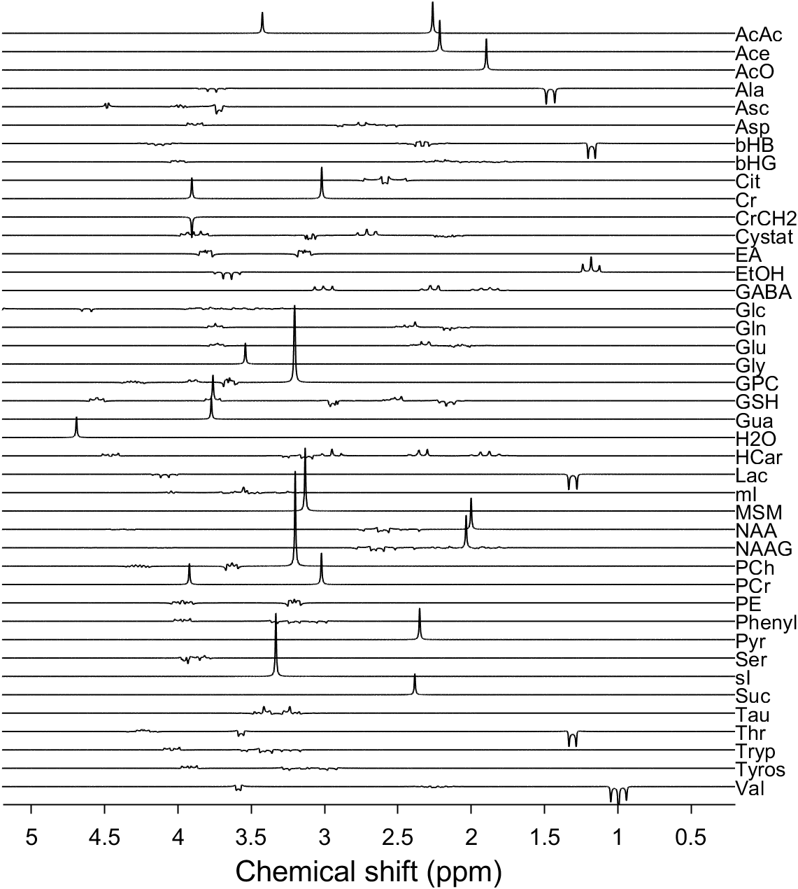

# plotLCMBasis

This is a little MATLAB function to quickly plot LCModel basis sets (.basis).

To generate a figure with staggered plots of basis functions in the basis set, simply run
```
out = plotLCMBasis('yourBasisSet.basis');
```



The amount of stagger is determined automatically, but can be overridden with an additional input argument (see below).

Text overlap is not controlled for, so you'll probably need to resize the figure a little.

## Usage

```
out = plotLCMBasis(basisSetFile, stagFlag, ppmmin, ppmmax, xlab, ylab, figTitle)
```

### Inputs

```
basisSetFile    = LCModel basis set in .basis format (required)
stagFlag        = flag to decide whether basis functions should be plotted
                    vertically staggered or simply over one another (optional.
                    Default: 1 = staggered; 0 = not staggered)
ppmmin          = lower limit of ppm scale to plot (optional.  Default = 0.2 ppm).
ppmmax          = upper limit of ppm scale to plot (optional.  Default = 5.2 ppm).
xlab            = Label for the x-axis (optional.  Default = 'Chemical shift (ppm)');
ylab            = label for the y-axis (optional.  Default = '');
figTitle        = label for the title of the plot (optional.  Default = '');
```

## Features

- Staggered and non-staggered plots of basis functions.
- Supports encrypted LCModel basis sets (as available on the LCModel website - not that anyone should use those)

## System requirements

This should run on any MATLAB version without toolboxes (but has not been systematically tested).

## Contact, Feedback, Suggestions, Feature Requests

Please open a GitHub issue.

## Acknowledgements

This work has been supported by NIH grants R00 AG062230 and R21 EEBB033516.

The LCModel basis set reading code features contributions from the following individuals:

- Jamie Near (Sunnybrook Institute, Toronto)
- Helge J. Zöllner (Johns Hopkins University)
- Alexander R. Craven (University Bergen)